# 项目概述
金融大数据处理技术**实验四**（by 221275024-陈巧蕾）

本项目基于 Apache  Spark编写了一系列数据分析任务，使用Maven管理项目，旨在从用户余额和银行利率数据中挖掘交易行为的统计信息和趋势。包含四个独立的MapReduce任务,具体设计思路以及运行结果如下。

# 任务一：Spark RDD编程

## 1.1 查询特定日期的资⾦流⼊和流出情况
    java文件路径为 `/src/main/java/com/lab2/UserBalanceAnalysis.java` 
### 设计思路
  **·** 首先创建 SparkConf 和 JavaSparkContext

  **·** 从HDFS中读取输入数据（user_balance_table.csv）

  **·** 将每一行数据转换成一个 JavaPairRDD，键为 reportDate（日期），值为一个包含 totalPurchaseAmt（资金流入量）和 totalRedeemAmt（资金流出量）的 Tuple2

  **·** 使用 reduceByKey，对具有相同 reportDate 的记录进行聚合。对每个reportDate，将流入量（totalPurchaseAmt）和流出量（totalRedeemAmt）分别累加

  **·** 格式化输出并保存结果。

## 运行结果

在终端运行Spark程序：

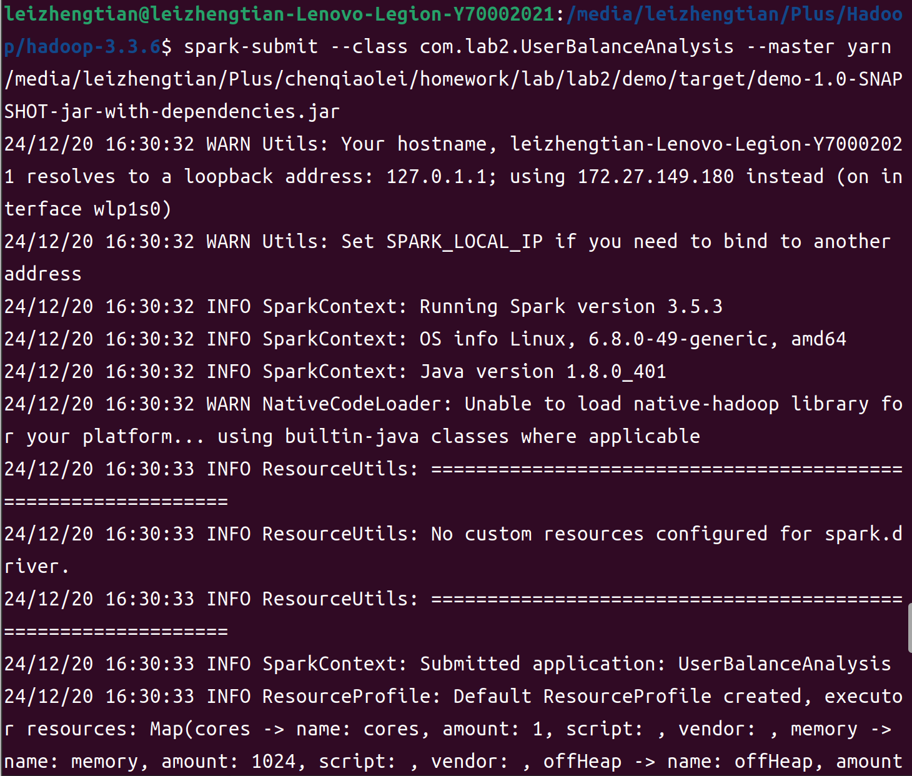

将输出结果保存在HDFS中的output4-1文件夹中，使用-ls查看output4-1文件夹内的内容：

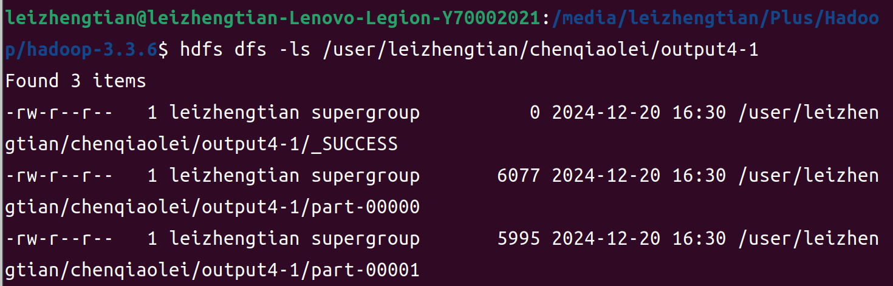

由于spark的输出分布在多个文件中（part-00001和part-00000），分别查看两个文件里的内容
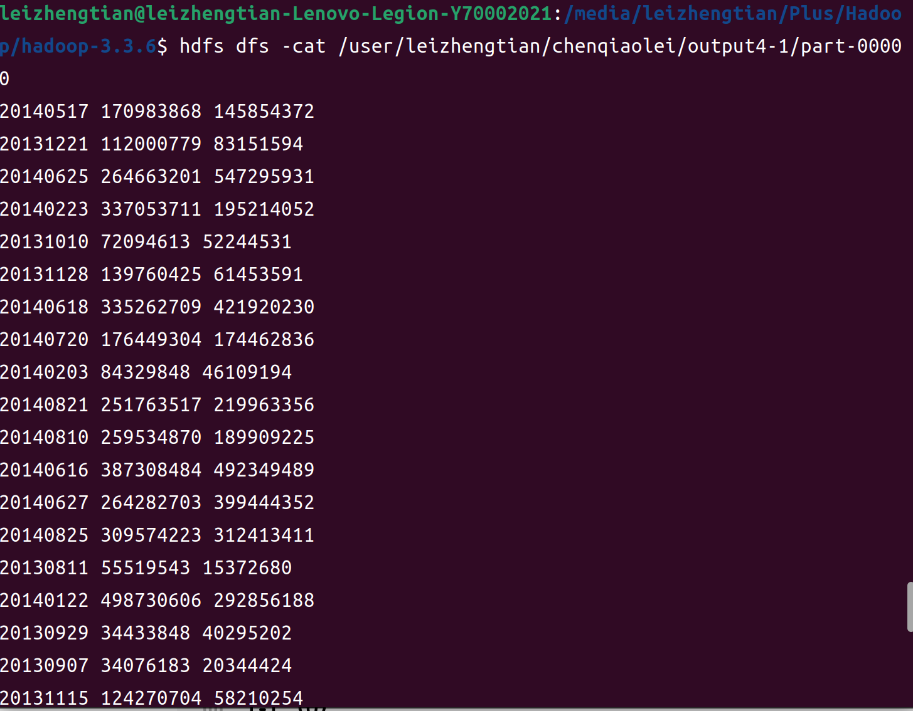
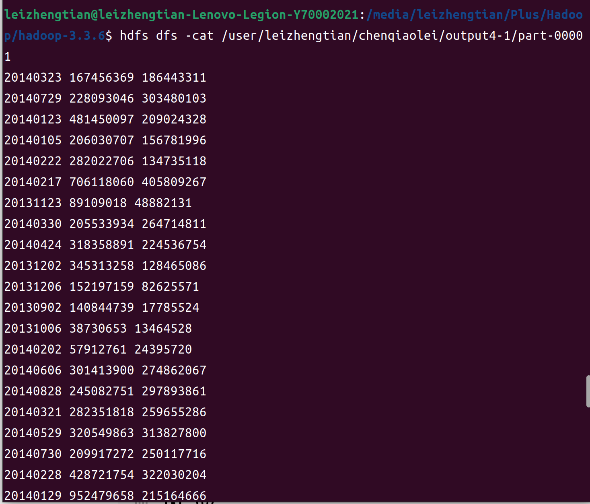

然后将两个文件进行合并，并把合并后的文件移动到本地文件系统。
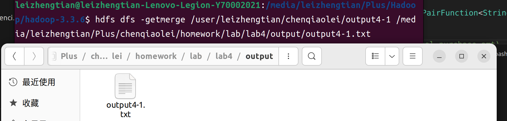

## 1.2 活跃⽤户分析
    java文件路径为 `/src/main/java/com/lab2/ActiveUserAnalysis.java` 

### 设计思路
  **·** 从从HDFS中读取输入数据（user_balance_table.csv）并处理数据

  **·** 设置目标日期范围为 2014 年 8 月 1 日至 2014 年 8 月 31 日。
  
  **·** 将每一行数据映射为 (userId, reportDate) 键值对。userId 是用户 ID，reportDate 是报告日期。
过滤条件是记录日期在 2014 年 8 月 1 日到 2014 年 8 月 31 日范围内，且
只保留那些有 直接购买量 或 总赎回量 大于 0 的记录（认为这些用户在该日期为活跃用户）。
最终得到 activeUserData 是一个包含 (userId, reportDate) 键值对的 RDD，每个记录表示某个用户在某个日期为活跃用户。

  **·** 按照 userId 对活跃记录进行分组，将同一个用户的多条活跃记录合并成一个 (userId, Set<String>) 的形式，Set<String> 存储该用户在 2014 年 8 月期间活跃的日期（使用 HashSet 去重）。

  **·** 使用filter筛选出在 2014 年 8 月内，活跃天数>= 5 天的用户，并依据活跃用户的ID计算活跃用户的数量。

  **·** 在终端输出结果。
## 运行结果

在终端运行Spark程序：

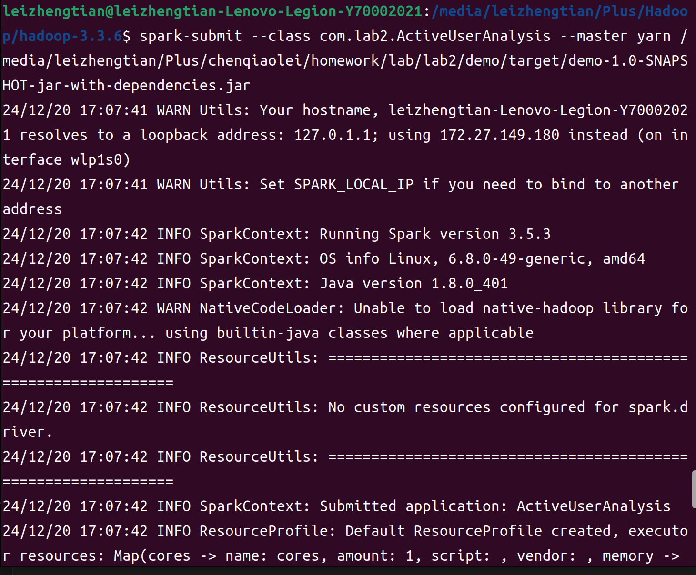

查看在终端显示的输出结果，可见，活跃用户数是3175：
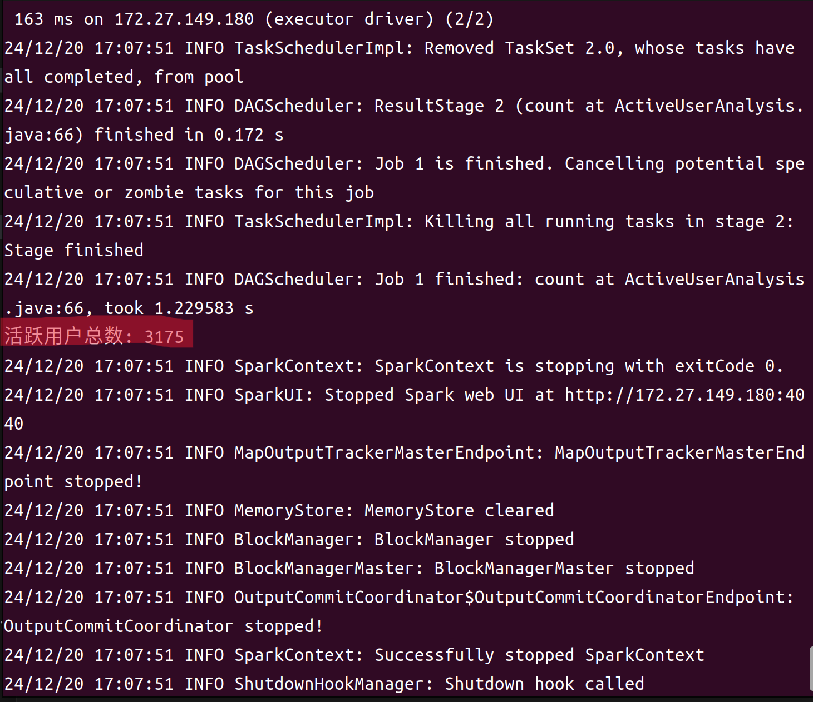

# 任务二：Spark SQL 编程
## 2.1 按城市统计2014年3⽉1⽇的平均余额
    java文件路径为: ` /src/main/java/com/lab2/CityBalance.java` 
### 设计思路
  **·** 分别加载 user_profile_table.csv 和 user_balance_table.csv 文件,筛选出 user_balance_table.csv 中日期为 2014 年 3 月 1 日的数据

  **·** 使用 user_id 将 user_profile_table.csv 和 user_balance_table.csv 进行连接，关联用户信息和用户余额。

  **·** 根据城市分组，计算每个城市在 2014 年 3 月 1 日的平均余额（tBalance）

  **·** 按平均余额降序排列，在终端输出城市及其平均余额
## 运行结果

运行SPARK程序，截图如下：

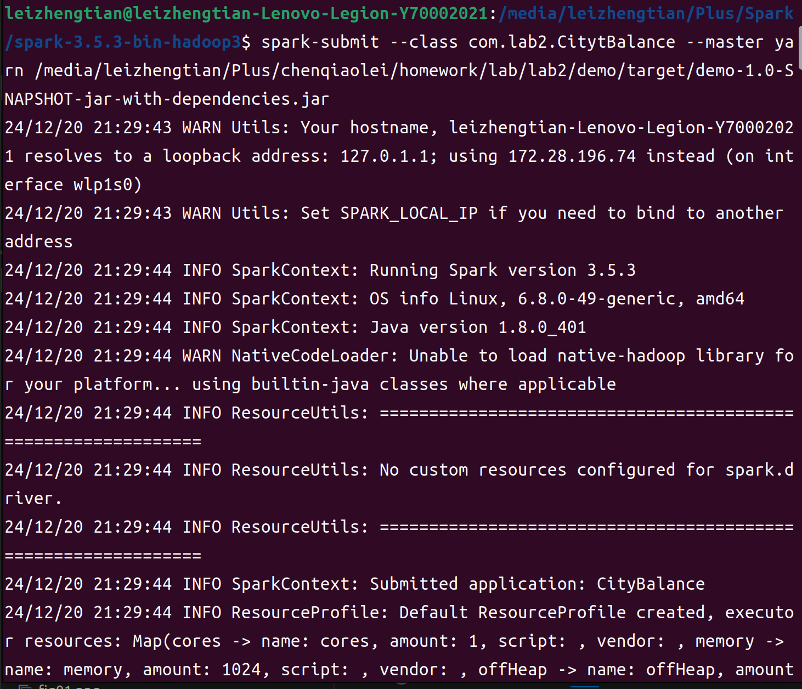

程序在终端输出统计结果，截图如下：
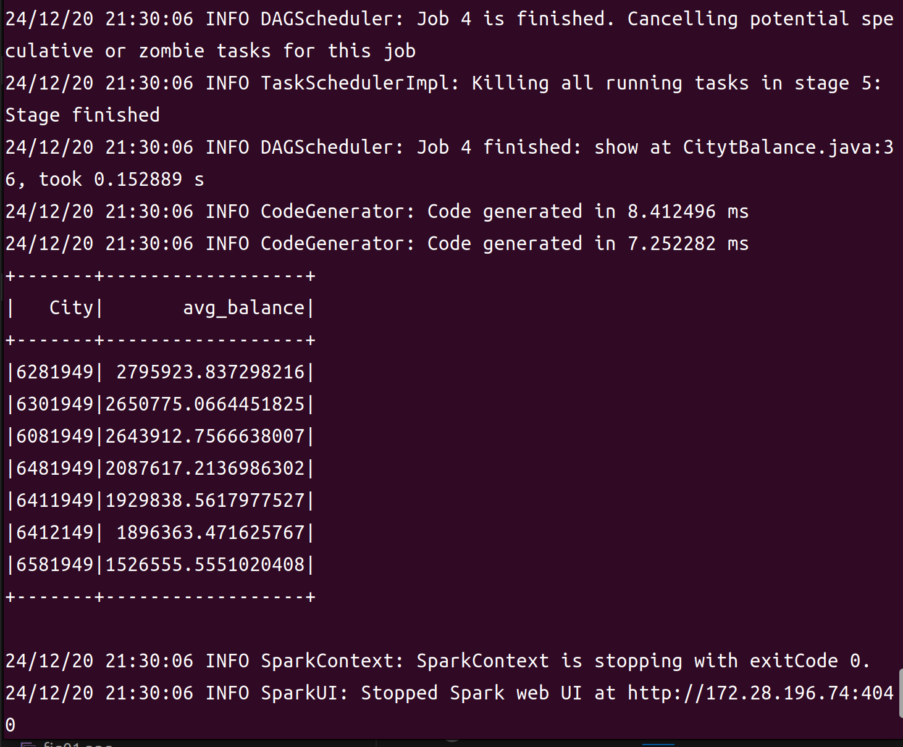

## 2.2 统计每个城市总流量前3⾼的⽤户
    java文件路径为: ` /src/main/java/com/lab2/TopUser.java` 

### 设计思路
  **·** 加载 user_profile_table.csv 和 user_balance_table.csv，筛选 user_balance_table.csv 中 report_date 在 2014 年 8 月的记录。

  **·** 使用 user_id 将 user_balance_table.csv 和 user_profile_table.csv 进行关联。

  **·** 计算每个城市中每个用户的总流量（total_purchase_amt + total_redeem_amt）
  
  **·** 使用窗口函数，按每个城市分组，计算总流量排名，提取前 3 名。在终端输出城市 ID、用户 ID 及其总流量。

### 运行结果

运行SPARK程序，截图如下：
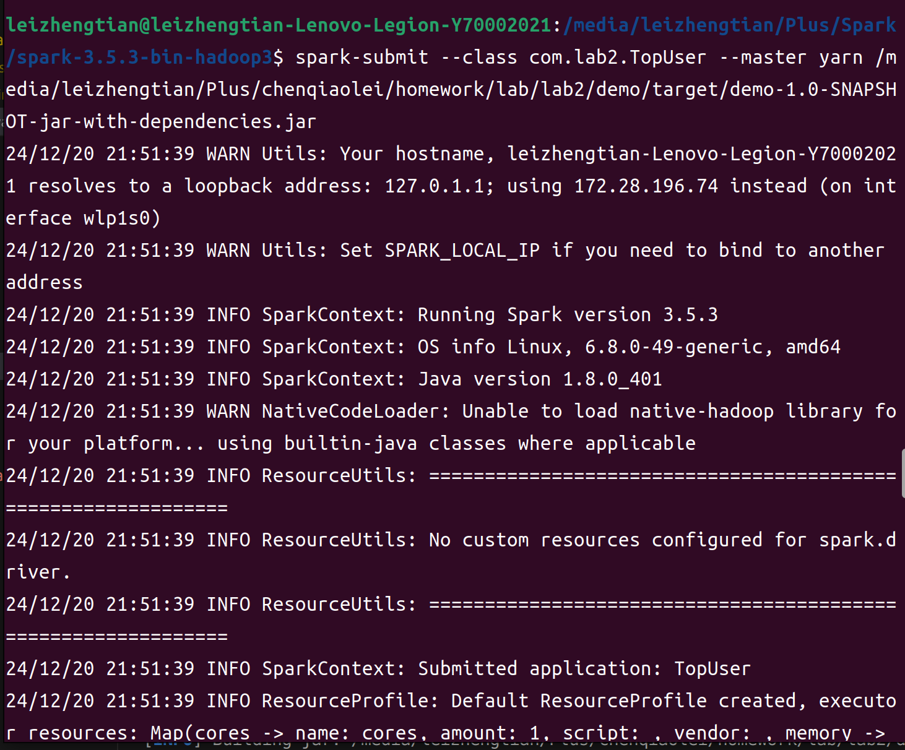

程序在终端输出统计结果，截图如下：
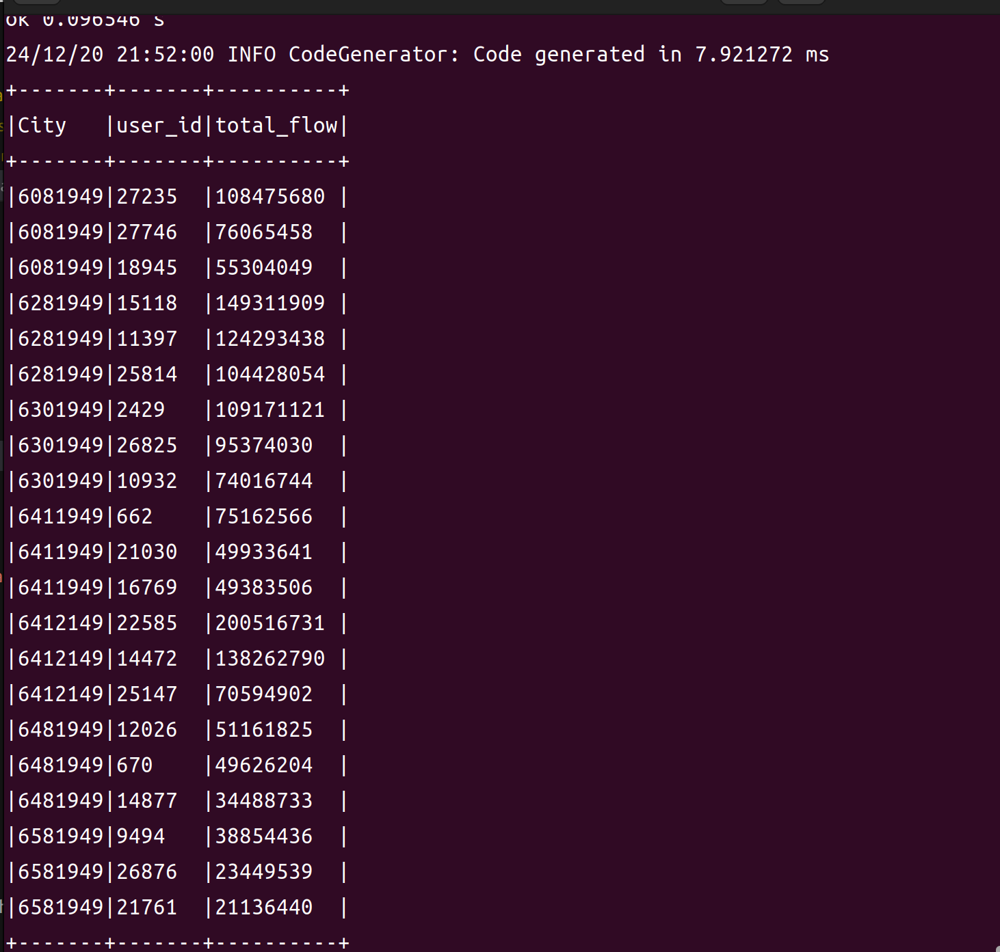

## 任务三：Spark ML编程

### 设计思路
  **·** 考虑到Spark MLlib中的机器学习模型有限，而阿里天池的此问题倾向于是一个时间序列回归模型（baseline），因此仅利用Spark MLlib中的线性回归模型进行回归预测。在后续的学习中，考虑使用LSTM深度学习模型再对本赛题进行进一步尝试。

  **·** 读取user_balance_table.csv文件，使用 selectExpr 来选取并转换需要的字段：report_date 转换为 INT 类型;total_purchase_amt 和 total_redeem_amt 转换为 BIGINT 类型，确保它们能容纳较大的数值。

  **·** 使用 groupBy("report_date") 按日期对数据进行分组。通过 agg 聚合函数，**计算每一天出的 申购总额 (purchase) 和 赎回总额 (redeem)**。并对日期进行排序，确保数据按日期顺序排列。

  **·** 特征工程：添加日期特征. 通过 row_number 函数为每一行添加一个新的列 day_index，这个列表示的是相对于 report_date 的 天数索引。这个 day_index 是线性回归模型的输入特征。

  **·** 将2013年7月到2014年8月份的数据作为训练集；使用 spark.range(20140901, 20141001) 生成 2014 年 9 月 1 日至 2014 年 9 月 30 日的日期序列。

  **·** 分别创建创建线性回归模型purchaseModel和redeemModel。使用训练集来训练模型，再将训练好的模型，在测试集上做预测。

  **·** 将得到的结果 purchasePredictions 和 redeemPredictions 根据 report_date 进行连接。最后，选择并格式化输出的字段。

  **·** spark的输出文件位于多个分区文件中，需要将多个csv文件合并到一个。

### 运行结果
运行SPARK程序，截图如下：
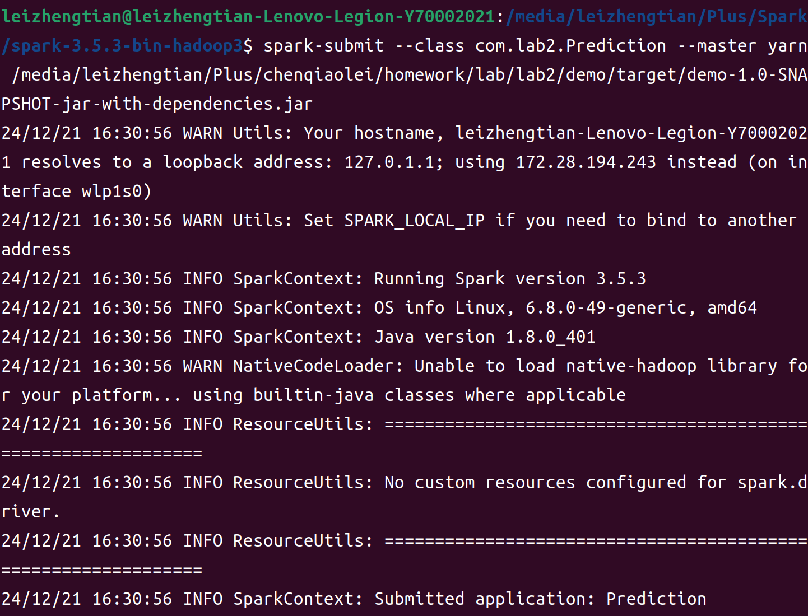

在终端查看输出的多个分区文件，截图如下：
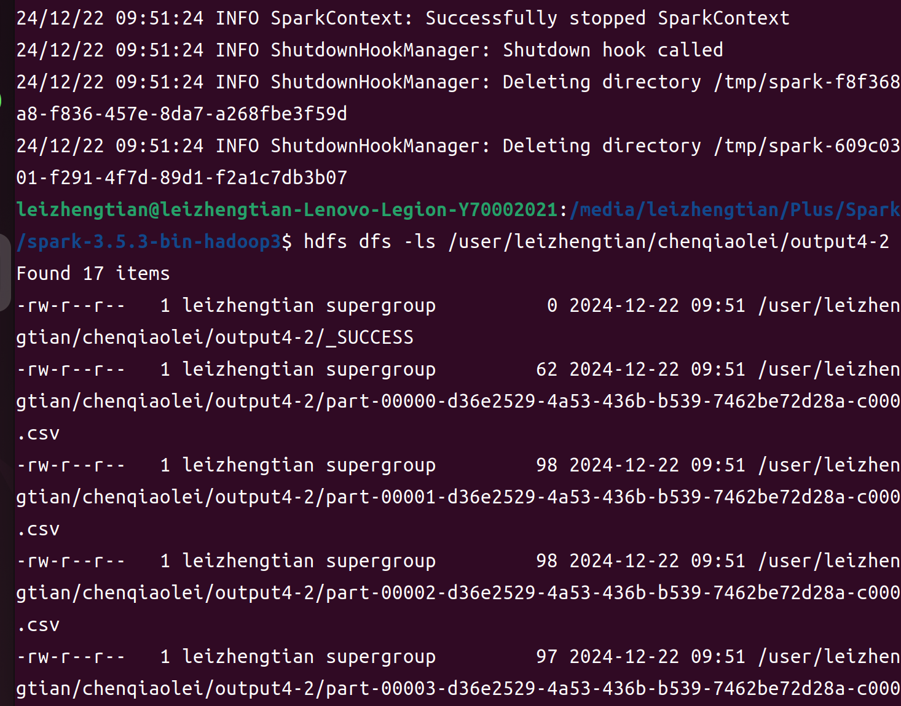

使用cat查看部分文件的内容：
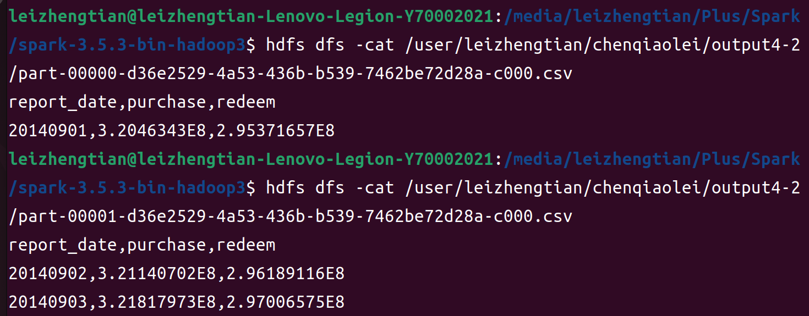

接下来将多个csv文件从HDFS中导出到本地文件系统。尝试过手动合并，也尝试过编写python代码将其合并，但都出现了精度损失的情况。因为：导出到本地的多个原始csv文件，点击看数值可以看到是整数，比如321140702，但是在表格视图以及直接复制一个框框时，数值却显示是3.21E+08这样的科学计数法。导致有精度损失。前面很多次操作（包括手动多个复制，还有python读取合并），都没能解决这个问题，而导致上传到阿里天池平台上测评时分数为0。 

最后采用了原始但最有效的方法，就是手动把原始csv文件中的每一个框框内真实值，复制到目标csv文件中。最终提交到阿里天池测评上。结果如下：

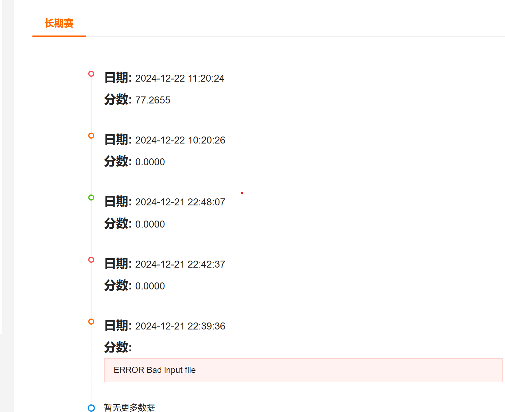

# 说明

由于在push到github仓库时，target/demo-1.0-SNAPSHOT-jar-with-dependencies.jar这个文件超过了Github限制的100.00 MB大小。所以把此文件删掉了。在项目文件夹中运行

      maven clean package

即可生成此jar包。
# 可以改进的地方

1. 在活跃用户分析时，使用了 HashSet 来存储每个用户的活跃日期，为优化性能，可以考虑直接使用 mapValues 来对用户的活跃日期进行去重和统计，而不是先做 groupBy，然后再用 filter 计算活跃天数。这样能避免重复的 groupBy 操作，提高性能。

2. 阿里天池平台的这个任务，结合我看到的论坛分享，即使要仅使用Spark MLlib的线性模型，感觉也可以仅截取后面部分的数据用于训练模型，比如2014年2月1日到2014年8月31日的数据。因为存在一些其它因素的干扰，可能因为某些形势上或者宣传上的因素，导致申购和赎回总量是分阶段性变化的。更合理的可能是把已有数据的日期-申购赎回总量的数据可视化，观察数据趋势，然后再做截取。